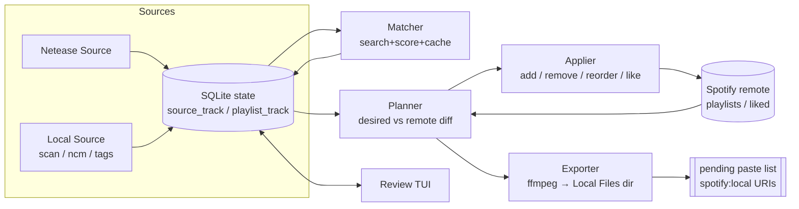

# Spotifify 设计文档

将网易云歌单 / 本地音乐库（含 `.ncm`）幂等地同步到 Spotify（镜像歌单 + Liked Songs）。
可由外部调度器定时运行；无法在 Spotify 上找到的歌曲走"本地文件"半自动路径。

## 0. 已定决策（来自需求问答）

| 项 | 决策 |
|---|---|
| 语言 / 运行时 | TypeScript, Bun ≥ 1.4（`bun:sqlite`、`bun build --compile`） |
| 目标 | 每个来源歌单 → 同名 Spotify 歌单；同时按配置把匹配到的歌曲加入 Liked Songs |
| 本地上传 | 半自动：解密/转码后写入 Spotify 桌面端"本地文件"目录，生成 `spotify:local:` URI 供一次性粘贴 |
| 匹配 | 分档：高置信自动加、中置信进复核队列、低置信视为未匹配 → 本地路径 |
| 删除 | 镜像但需 `--prune` 显式确认；默认只报告待删项 |
| 远端漂移 | 来源为准：Spotify 端手动删掉的工具会重新加回 |
| 顺序 | 严格镜像来源顺序 |
| 网易云 | 扫码/Cookie 登录；同步自建歌单 + "我喜欢的音乐"；不含收藏的他人歌单 |
| 本地库 | 全部合并为一个固定歌单（默认 `Local Library`）；仅支持 `.ncm` 加密格式 |
| 本地元数据 | Tag + 文件名；可选 Chromaprint/AcoustID 声纹作为二级 fallback |
| 转码 | 按需：mp3/m4a 直接拷贝；flac/ogg/wav → mp3 320k（ffmpeg） |
| 区域不可播放 | 视为未匹配 → 本地路径 |
| 网络 | 不做代理配置；market 用 `from_token` |
| 复核 | Ink (React) TUI |
| 定时 | 外部调度（Windows 任务计划）；工具单次运行退出 |

## 1. 硬约束（设计围绕它们展开）

1. **Spotify Web API 不能把本地文件加入歌单**（`POST /playlists/{id}/tracks` 对 `spotify:local:` 返回 400），但**可以读取、重排、删除**歌单里已存在的本地文件项。→ 本地文件的"加入"必须由人在桌面端完成一次；之后的排序/删除工具可以接管。
2. Spotify 桌面端"本地文件"官方仅支持 mp3 / m4a(AAC) / mp4；FLAC 非官方且不同步到手机。→ 需要 ffmpeg 转码。
3. 桌面端把本地文件的身份定义为 `spotify:local:{artist}:{album}:{title}:{durationSec}`（各段 URL 编码，空格为 `+`，客户端自己会把 `(` 写成 `%28`），前三段来自文件 tag，**最后一段是客户端自己算出的整秒时长**：贴一个三段 URI 进去，API 里读回来是 `…:0`；只有四段全部与客户端索引里的值一致，条目才会链接到文件，否则灰掉（"can't play this right now… you can import it"）。这个时长**不是 ffprobe 的时长**：对 81 个 CBR mp3 逐一核对客户端索引（`local-files.bnk`），公式是 `floor((Xing/Info 帧数 + 1) × 每帧采样数 / 采样率)`（CBR 下等于 `floor(音频字节数 × 8 / 码率)`），ffprobe 的 gapless 裁剪值在约 5% 的文件上取整不同。→ 工具写入文件时**必须控制 tag**，并用同一公式算时长（`src/sync/duration.ts`）；VBR（"Xing" 帧）文件的客户端算法未验证，导出时一律重编码成 CBR。
4. `NeteaseCloudMusicApi`（npm 4.32.0）仓库已归档，仅作为库调用；接口随时可能失效。→ 用薄适配层隔离，只依赖 6 个接口。
5. Spotify 搜索对 CJK 标题/艺人质量不稳定；网易云艺人名常是中文而 Spotify 用罗马音/英文（日韩艺人）。→ 多查询策略 + 别名表 + 复核队列。

## 2. 架构



单次 `sync` 分六个阶段，每阶段幂等、可单独重跑：

| 阶段 | 输入 | 输出 |
|---|---|---|
| `pull` | 网易云 API / 本地目录 | `source_playlist`, `source_track`, `playlist_track` 更新 |
| `match` | `match.status ∈ {pending}` 或到期重试的 track | `match` 行（status / spotify_id / candidates） |
| `export` | `status = local` 且有本地文件的 track | export.dir 中的文件 + `local_export` 行（在 plan 之前，使当次 plan 就能列出待粘贴项） |
| `plan` | 本地状态 + 远端歌单/Liked 快照 | `Plan`（纯数据，可 `--dry-run` 打印） |
| `apply` | `Plan` | Spotify 写操作 + 状态回写 |
| `report` | 状态 | 摘要、复核数、待粘贴列表、退出码 |

幂等性来源：**远端真实状态每次重新拉取**，Plan 是 `desired − remote` 的差；SQLite 只缓存来源快照、匹配决策和"哪些是工具加的"，不是远端的镜像。任何阶段中途崩溃，下次重跑得到同样或更小的 Plan。

## 3. 数据模型（SQLite，`~/.spotifify/state.db`）

完整 DDL 见 `src/state/schema.sql`。核心表：

```
source_playlist   id, kind('netease'|'local'), external_id, name, source_updated_at, last_seen_at
source_track      id, kind, external_id, canonical_key, title, artists(JSON), album, duration_ms,
                  isrc, netease_id, aliases(JSON), file_path, content_hash, file_size, file_mtime,
                  first_seen_at, last_seen_at
playlist_track    source_playlist_id, source_track_id, position          PK(playlist, track)
match             canonical_key PK, status, spotify_id, spotify_uri, score, decided_by,
                  candidates(JSON), decided_at, last_search_at, search_count
spotify_playlist  source_playlist_id PK, spotify_id, name, snapshot_id, last_synced_at
managed_item      spotify_playlist_id, uri, added_at                     PK(playlist, uri)
liked             spotify_id PK, added_at
local_export      canonical_key PK, export_path, local_uri, content_hash, exported_at
search_cache      key PK, response(JSON), fetched_at
fingerprint       content_hash PK, fp, duration_s, acoustid(JSON), isrcs(JSON), fetched_at
auth              provider PK, payload(JSON), updated_at
run               id, started_at, finished_at, ok, summary(JSON)
```

### 3.1 身份：`canonical_key`

同一首歌可能来自多个来源（网易云歌单里的 X、本地 `X.ncm`）。匹配决策按 canonical_key 共享，避免重复搜索/复核：

1. 已知网易云 song id（网易云来源，或 `.ncm` 头部 `musicId`）→ `netease:{id}`
2. Tag 含 ISRC → `isrc:{ISRC}`
3. 其他本地文件 → `local:{blake2b256(file)}`

本地文件的变更检测：`(path, size, mtime)` 三元组未变则跳过 hash；变了重新 hash。文件移动 → hash 相同 → 同一 track，只更新 `file_path`。

### 3.2 `match.status` 状态机

```
pending ──search──▶ matched     (score ≥ auto_threshold 且通过硬门槛; decided_by=auto|isrc|fingerprint)
        ──search──▶ review      (review_threshold ≤ score < auto_threshold)
        ──search──▶ local       (无候选 / score < review_threshold / 仅有不可播放候选; decided_by=auto)

review  ──TUI────▶ matched (decided_by=user) | local (user) | skipped (user)
matched/local(user) ──`rematch`──▶ pending
local(auto) ──到期(retry_unmatched_after_days)──▶ pending      # 曲库会变，定期重搜
```

* `matched` → 进入 Spotify 歌单/Liked。
* `local` → 进入 export 路径（仅当该 track 有本地文件；网易云来源且本地无文件的 `local` 只出现在报告里）。
* `review` / `skipped` → 不同步。
* 用户决策 (`decided_by=user`) 永不被自动重搜覆盖。

## 4. 来源

### 4.1 网易云（`src/sources/netease`）

依赖 `NeteaseCloudMusicApi` 的 7 个接口：`login_qr_key` / `login_qr_create` / `login_qr_check` / `login_status` / `user_playlist` / `playlist_detail` / `song_detail`。**不经由包的 `main.js`**（它用 `readdirSync(__dirname/module)` + 动态 `require` 加载端点，只能在 node_modules 在磁盘上时工作，编译成单文件后失效），而是由 `lib.ts` 静态导入 `module/*.js` 与 `util/request.js` 并复刻其 cookie 处理。全部封装在 `NeteaseClient` 接口后面，便于替换实现。

* 登录：`spotifify auth netease` 终端渲染二维码轮询；或 `--cookie "MUSIC_U=..."` 直接粘贴（QR 接口在归档后偶发 801）。Cookie 存 `auth` 表。定时任务中 Cookie 失效 → 退出码 3，不做其他操作。
* 歌单选择：`user_playlist(uid)` 中 `creator.userId == uid` 的歌单（含 `specialType == 5` 的"我喜欢的音乐"）；`include_playlists` 非空时只取其中列出的（歌单名 / id / 特殊值 `"liked"`），再减去 `exclude_playlists`。CLI 的 `--playlist <名>` 只作用于 match/plan/apply，pull 不过滤（否则会把其余歌单当作已删除清掉）。
* 增量：`playlist_detail` 返回 `trackIds[]`（完整）与 `updateTime`；`updateTime` 未变则跳过。新 id 用 `song_detail` 按 500 一批拉取（`name / ar[].name / al.name / dt / alia / tns`），`alia`/`tns` 进 `aliases` 供匹配。
* 请求串行，间隔 200 ms。

### 4.2 本地库（`src/sources/local`）

* 递归扫描 `local.dirs`，扩展名白名单。
* `.ncm`：先只解析头部拿元数据（`musicId / musicName / artist / album / duration / format`），**不解密音频**；只有走 export 路径时才解密。算法（AES-128-ECB 解 RC4 key 与 metadata、变种 RC4 keybox 解音频）公开且稳定，约 120 行，自实现于 `src/sources/local/ncm.ts`，避免依赖无人维护的 npm 包；用固定 fixture 做回归测试。
* 其他格式：`music-metadata` 读 title/artist/album/duration/ISRC；缺失时按文件名模式 `艺人 - 标题` / `标题 - 艺人`（可配置顺序）兜底。tag 读取失败（如分片 m4a）只降级为文件名，不跳过文件。
* 网易云客户端下载的普通 mp3/flac/m4a 在注释 tag（ID3 `COMM` / Vorbis `DESCRIPTION` / `©cmt`）里带 `163 key(Don't modify):<base64>`，内容与 ncm 头部相同（AES-128-ECB[META_KEY]，`music:` + JSON）。解出 `musicId` 后与 `.ncm` 一样得到 `neteaseId`，因此非 VIP 下载也能和网易云歌单里的歌共享 key；艺人 tag 里的 `/` 分隔按网易云习惯拆开。
* 所有本地 track 归入一个 `source_playlist(kind='local')`，顺序 = 路径字典序（稳定、可预测）。
* `local.mirror_playlist = false` 时不为本地库创建 Spotify 歌单：本地文件只作为**其他歌单里未匹配歌曲的音频来源**。因为 `.ncm` 头部带 `musicId`，本地文件和网易云歌单里的同一首歌共享 `canonical_key`，网易云歌单的 `local` 项由此获得文件 → 导出 → 出现在该歌单的待粘贴列表里。match / export 只处理"被镜像歌单引用"的 key，本地库里多余的文件不会消耗搜索配额。典型用法：把 `local.dirs` 指向网易云客户端的下载目录，`spotifify unmatched` 列出还缺文件的歌，在客户端下载它们，再 `sync`。

## 5. 匹配（`src/match`）

### 5.1 查询序列（并集去重后统一打分）

1. `isrc:{ISRC}`（tag / 声纹得到）
2. `track:"{title}" artist:"{artist0}"`
3. `{title} {artist0}`（无字段限定）
4. 对每个 alias / 译名重复 2–3
5. `{title}`（仅当艺人相似度 ≥ 0.8 才接受）

全部带 `market=from_token&limit=10`；结果缓存 `search_cache`（key = sha1(query+market)，TTL 30 天）。`is_playable == false` 的候选直接剔除（决策：区域不可播放视为未匹配）。

### 5.2 归一化（`normalize.ts`）

NFKC → 小写 → OpenCC 繁→简 → 全角转半角 → 提取并移除括号内容作为 *version tags*（live / remix / instrumental / acoustic / demo / cover / 伴奏 / dj版 / 现场 / 纯音乐 …）→ `feat.`/`ft.`/`&`/`、`/`/` 拆分艺人并入艺人集合 → 去标点空白。艺人别名表 `matching.artist_aliases` 在归一化后应用。

### 5.3 打分

```
title   = max over (title, aliases) 的归一化 Levenshtein 相似度
artist  = 艺人集合两两最大相似度（任一精确相等 → 1）
album   = 相似度，缺失 → 0.5
dur     = |Δ| ≤ tol → 1；≤ 10 s → 0.5；否则 0
score   = 0.45·title + 0.30·artist + 0.10·album + 0.15·dur
```

`matched(auto)` 硬门槛：`score ≥ auto_threshold(0.90)` ∧ `title ≥ 0.9` ∧ `artist ≥ 0.8` ∧ `dur == 1` ∧ version tags 相等。ISRC 命中 → 直接 `matched(isrc)`，跳过打分。

### 5.4 声纹（可选，`matching.fingerprint = true`）

仅对本地文件、且 5.1 未得到 `matched` 时触发：`fpcalc -json` → AcoustID `lookup(meta=recordings)` → MusicBrainz `recording/{mbid}?inc=isrcs`（1 req/s）→ ISRC → 5.1 步骤 1。结果按 `content_hash` 缓存。`fpcalc` 不存在或无 `acoustid_key` 时静默跳过并在 `doctor` 里提示。

### 5.5 别名挖掘（`spotifify aliases`）

`matching.artist_aliases` 不必手写：从身份确定的匹配（`decided_by ∈ {user, isrc, fingerprint}`）里，把当前别名表应用后仍配不上的艺人两两比对——来源侧恰好剩 1 个、Spotify 侧恰好剩 1 个时就是同一艺人的两个写法（陈奕迅 → Eason Chan）。相似度 ≥ 0.8 的对（模糊打分本来就认得）不提议；同一来源名对应多个目标名时取最多的并标出冲突。`--apply` 经 `withArtistAliases` 写回配置（走模板重渲染，留 `.bak`）。别名只影响打分不影响查询串，所以 `rematch --all-local` 后重跑用的是 `search_cache`，不耗配额。

## 6. 规划与应用（`src/sync`）

### 6.1 歌单 desired 序列

对每个来源歌单，按 `playlist_track.position` 生成 `desired: Item[]`：

* `match.status == matched` → `{ uri: spotify:track:…, kind: 'spotify' }`
* `match.status == local` ∧ 存在 `local_export` → `{ uri: local_export.local_uri, kind: 'local' }`
* 其他 → 跳过
* 同一 URI 只保留第一次出现（去重）。

### 6.2 远端快照

`GET /playlists/{id}/items`（50/页，`fields` 限定 `uri,is_local,name,artists,duration_ms`）。本地项的 URI 解码后与 `local_export.local_uri` 比较（桌面端编码细节不完全稳定——例如它把 `(` 写成 `%28`——比较用解码后的规范四段形式）。艺人/专辑/标题都对得上但身份不同的条目（时长段不同或缺失、三段粘贴被客户端改写成的 `:0`、带旧后缀的标题）归为 **stale**：它们是本工具早期粘贴的、客户端永远播不了的残留，`--prune` 时按 position 删除，删后该歌重新进入待粘贴列表。

### 6.3 Diff → Plan

```
present   = desired ∩ remote
toAdd     = desired.spotify − remote                  # POST /items，100/批，追加到末尾
awaiting  = desired.local − remote                    # 无法 API 添加 → pending paste 列表
stale     = remote − desired
  ├ managed_item 里有（工具加的） → prune 候选（--prune 才执行；本地项用 positions+snapshot_id 删）
  └ 没有（人加的 / 粘贴进来的本地项且来源已删）→ foreign，保留在尾部，仅报告
targetOrder = desired.filter(present ∪ toAdd) ++ stale(保持现有相对顺序)
moves     = reorderPlan(currentOrder, targetOrder)    # 见 6.4
likes     = (∪ 各来源 like_matched=true 歌单的 matched spotify_id) − remoteLiked   # PUT /me/tracks 50/批
unlikes   = liked(工具加的) − desired 全集             # --prune 才执行
exports   = status=local ∧ 有本地文件 ∧ 无 local_export 或 content_hash 变化
creates   = 无 spotify_playlist 映射，或映射的 spotify_id 已 404 / 不在 /me/playlists
renames   = 来源歌单改名
```

"来源为准重加"由 `toAdd` 天然覆盖：用户在 Spotify 端删掉的会再次出现在 `desired − remote`。

`managed_item` 只在工具成功 add 之后写入；Liked 也一样——先 `GET /me/tracks/contains`，本来就 liked 的不入 `liked` 表，因此永不被 unlike。

### 6.4 严格顺序：最小移动重排

`PUT /playlists/{id}/tracks` 的 `range_start/insert_before/snapshot_id` 每次只能搬一段。用 LIS：保留 `current` 中相对顺序已正确的最长子序列，其余元素逐个移动，移动数 = n − |LIS|，每次移动链式使用返回的 `snapshot_id`。首建时按 desired 顺序批量 POST，之后增量同步通常 0–几次移动。当歌单里**没有本地项**、移动数 > 5 且 > n/3 时改用整表 `PUT uris`（100/批 + 追加）——本地项无法用该接口写回，因此含本地项时禁用。

### 6.5 Export（`export.ts`）

* 输出目录 `export.dir`（用户已在 Spotify 桌面端 *设置 → 本地文件* 添加为来源）。
* 文件名 `{artist} - {title}.{mp3|m4a}`，Windows 非法字符替换；冲突加 `(2)`。
* 统一经 ffmpeg：已是 mp3/m4a → `-c:a copy`；其他 → `libmp3lame -b:a 320k`。总是写规范 tag（title / artist / album / 封面）并删除其他 tag，使 `local_uri` 可预测。`.ncm` 先解密到临时文件再进 ffmpeg。
* **落盘方式受客户端监视器约束**：桌面端实时监视 `export.dir`，行为是"目录项**新建**时解析一次；目录项消失时删除索引；中间不再重读"。由此：(1) ffmpeg 不能直接写最终文件名——写到一半的 mp3 Xing 头还没回填、m4a 的 moov 还没前移，客户端把时长记成未知（界面显示 `1193046:28:15` = 0xFFFFFFFF），永远播不了；(2) 用 `rename` 覆盖已有文件会让客户端删掉旧索引却**不**为新名字建索引（实测：覆盖 81 个文件后索引清空，粘贴的条目全部变灰）。所以 ffmpeg 输出到 `{export_path}.part`（非音频扩展名，客户端忽略），完成后先删旧文件（客户端删索引），再对 `.part` 建**硬链接**到最终名——目录项瞬间出现且内容完整，客户端按"新建"解析一次；最后删 `.part`。不支持硬链接的文件系统退化为 rename，并提示重启客户端。已经被记坏/清空的索引：重启客户端，或在 设置 → 本地文件 里关掉再打开该文件夹让它重建。
* **不要动 tag 来"防版权"**：曾以为本地文件变灰是桌面端按 标题+艺人 链接到本地区不可用的曲库条目，给标题加过后缀；实测无效——变灰的真实原因是粘贴的 URI 与客户端自己的文件身份不一致（§1 第 3 条：时长段必须等于客户端索引值），改 tag 只会再制造一层不一致。写完文件后按 §1 第 3 条的公式从**导出结果**（不是源文件）算时长，写进 `local_uri`；`local_export` 里没有时长段的旧行视为不完整，下次 export 自动重做。删除客户端正打开（播放中）的旧文件在 Windows 上 EPERM，带退避重试（6 次 / ≤ 16 s），仍失败则记为 export 错误，下次再来。
* 写 `local_export(canonical_key, export_path, local_uri, content_hash)`；hash 未变则跳过。
* 源库文件永不修改。

### 6.6 粘贴流程

`sync` 结束后打印每个歌单的 `awaiting` 列表；`spotifify pending --copy [--playlist X]` 把 URI（每行一个）复制到剪贴板（Windows `clip`，macOS `pbcopy`）。用户在桌面端打开对应歌单 Ctrl+V。下次 `sync` 的远端快照会看到这些本地项，进入 `present`，参与排序/删除。如果桌面端某版本不再接受粘贴 URI，退化为从"本地文件"页拖拽——工具侧无差别。

## 7. Spotify 客户端（`src/spotify`）

* **鉴权**：Authorization Code + PKCE（无需 client secret）。用户在 Developer Dashboard 建 app，Redirect URI `http://127.0.0.1:{redirect_port}/callback`。`spotifify auth spotify` 起本地 HTTP 监听、打开浏览器（Windows 用 `rundll32 url.dll,FileProtocolHandler`，`cmd /c start` 会把 `&` 当命令分隔符截断 URL）、换 token，存 `auth` 表。access token 过期或 401 时用 refresh token 刷新并回写。Scopes：`playlist-read-private playlist-modify-private playlist-modify-public user-library-read user-library-modify user-read-private`（最后一个是 `/me.country` 与按市场搜索的前提，缺了 `/search` 返回 403 Insufficient client scope；CLI 启动时校验已存 token 的 scope）。`market = "from_token"` 在启动时经 `/me.country` 解析成具体国家码。
* **HTTP**：Bun `fetch` 薄封装：自动分页、`429` 按 `Retry-After` 退避（≤ 120 s）、5xx 指数重试。**Development Mode 应用的 `/search` 有每日配额**，超出后 429 的 `Retry-After` ≈ 24 h：此时抛 `SpotifyRateLimitedError`，match 阶段停止、截止时间写入 `meta.spotify_search_blocked_until`，plan/apply 照常处理已匹配部分；截止前的后续运行直接跳过 match。为避免撞配额，每次运行有搜索预算 `max_searches_per_run`（缓存命中不计）、每首歌最多 `max_queries_per_track` 个查询、并发 `search_concurrency` 与最小间隔 `search_min_interval_ms`。不引入官方 SDK（其 token 策略面向浏览器，对 CLI 刷新流程不友好；所需端点 < 15 个）。
* 使用端点（2025 起 Spotify 对新应用只开放新路径，旧路径 `/users/{id}/playlists`、`/playlists/{id}/tracks`、`/me/tracks/contains`、`PUT/DELETE /me/tracks` 一律 403）：`/me`, `/me/playlists` GET/POST(create), `/playlists/{id}` GET/PUT(rename), `/playlists/{id}/items` GET/POST/PUT/DELETE（条目字段是 `item`；DELETE 曲库曲目用 `items:[{uri}]`，**本地文件只能按位置删**——`spotify:local:` URI 会被当 track id 解析而 400 "Invalid base62 id"，改发 `positions:[…]`，按位置从高到低、链式 snapshot_id，避免前面的索引位移）, `/me/library?uris=` PUT/DELETE, `/me/library/contains?uris=`（每次 ≤ 40）, `/me/tracks` GET（列全库，作 contains 的兜底）, `/search`, `/tracks/{id}`。
* 所有工具创建的歌单 description 固定为 `Managed by Spotifify`，便于识别。

## 8. CLI（`src/cli.ts`，commander）

```
spotifify init [--upgrade|--force]   生成模板；--upgrade 把新版本新增的选项合并进现有配置（保留原值，写 .bak）
spotifify doctor                     检查配置（含"有新选项未写入"提示）/ ffmpeg / fpcalc / 鉴权 / export 目录 / DB
spotifify auth spotify               PKCE 登录
spotifify auth netease [--cookie]    扫码或粘贴 Cookie
spotifify sync [--dry-run] [--prune] [--source netease|local] [--playlist <name>] [--skip-match]
spotifify review                     Ink TUI 复核队列
spotifify status                     各状态计数、歌单映射、待粘贴数、上次运行
spotifify unmatched [--status local|review|all] [--tsv]   列出无匹配的歌及其本地文件/导出状态（网易云链接便于下载）
spotifify aliases [--apply] [--min <n>]   从已确认的匹配推断艺人别名；--apply 写入配置
spotifify pending [--copy] [--playlist <name>]
spotifify rematch <canonical_key>|--all-local
spotifify export [--force]           只跑 export 阶段；--force 重导出已存在的文件（改了 bitrate，或需要刷新 tag/URI 时）
spotifify task install|uninstall     注册 / 注销 Windows 任务计划（调用 scripts/register-task.ps1）
```

退出码：`0` 成功（即使有复核/待粘贴）；`1` 运行错误；`3` 鉴权失效需人工重登。全局 `--config <path>`、`--state-dir <dir>`、`--log-file`。

## 9. 复核 TUI（`src/tui`，Ink 5 + React 18）

布局：左列复核项列表（来源歌单 / 标题 / 艺人 / 分数），右侧对比面板——来源 vs 候选逐列对齐显示 title / artists / album / duration(Δ) / score / playable，候选按分数排序。

按键：`j/k` 移动，`Tab` 切换 review / local 列表，`1-9` 选候选，`Enter` 确认，`o` 在浏览器打开选中候选（open.spotify.com/track/…），`O` 打开来源（网易云歌曲页，本地文件则用默认播放器打开），`l` 标为本地上传，`s` 跳过，`/` 自定义搜索词（`ink-text-input`），`p` 粘贴 Spotify 链接/URI 直接指定，`u` 撤销上一决策，`?` 帮助，`q` 退出。每个决策立即写库（`decided_by=user`），无"保存"步骤。

风险：Ink 依赖 `process.stdin.setRawMode`，Bun 1.4 已支持；若遇到问题，`review` 子命令可用 `node` 运行同一份代码（无 Bun 专属 API 进入 TUI 模块，DB 通过接口注入）。

## 10. 配置（`~/.spotifify/config.toml`，`smol-toml` + zod）

```toml
[spotify]
client_id = ""
redirect_port = 8765
market = "from_token"

[netease]
enabled = true
include_liked = true
include_playlists = []               # 例如 ["liked"] 只同步"我喜欢的音乐"
exclude_playlists = []
like_matched = true

[local]
enabled = true
dirs = ["D:/Music"]
playlist_name = "Local Library"
mirror_playlist = true                # false：本地库只给其他歌单的未匹配歌曲供音频，不建歌单
extensions = ["mp3", "flac", "m4a", "ogg", "wav", "ncm"]
filename_pattern = "artist-title"     # 或 "title-artist"
like_matched = false

[export]
dir = "D:/Spotify Local Files"
ffmpeg = "ffmpeg"
bitrate = "320k"

[matching]
auto_threshold = 0.90
review_threshold = 0.60
duration_tolerance_ms = 3000
retry_unmatched_after_days = 30
search_cache_ttl_days = 30
max_searches_per_run = 400            # 每次运行的搜索预算（缓存命中不计）；0 = 不限
max_queries_per_track = 4
search_concurrency = 2
search_min_interval_ms = 120
fingerprint = false
fpcalc = "fpcalc"
acoustid_key = ""

[matching.artist_aliases]
"周杰倫" = "周杰伦"

[sync]
playlist_prefix = ""                  # 例如 "NE · "
```

## 11. 目录结构

```
src/
  cli.ts                     入口；命令注册；sync 的 pid 锁
  config.ts                  配置 schema / 加载 / 默认值
  state/
    schema.sql               DDL（版本化迁移）
    db.ts                    打开 + 迁移
    repo.ts                  类型化查询（source / match / export / managed / liked / cache）
  sources/
    types.ts                 SourcePlaylist / SourceTrack / canonicalKey()
    netease/lib.ts           NeteaseCloudMusicApi 的可打包入口：先建 <tmp>/anonymous_token 再 require 各 module（Bun 先于 ESM 主体求值 CJS 依赖，静态 import 保证不了顺序）
    netease/client.ts        7 个接口的类型化封装 + 错误分类
    netease/auth.ts          扫码登录 / cookie 规范化
    netease/source.ts        pull 实现（按 trackUpdateTime 增量）
    local/scan.ts            遍历 / 变更检测 / hash
    local/ncm.ts             ncm 头部解析 + 解密
    local/tags.ts            music-metadata + 文件名兜底
    local/source.ts          pull 实现
  match/
    types.ts                 MatchStatus / Candidate / Decision
    normalize.ts             归一化 / version tags / 艺人拆分
    score.ts                 打分与硬门槛
    search.ts                查询序列 + 缓存
    fingerprint.ts           fpcalc / AcoustID / MusicBrainz
    matcher.ts               状态机驱动
  spotify/
    auth.ts                  PKCE + token 刷新
    client.ts                fetch 封装 / 分页 / 429（SPOTIFIFY_SPOTIFY_API 可指向测试假服务）
    api.ts                   端点函数
    localUri.ts              spotify:local 编解码
    types.ts
  sync/
    plan.ts                  Plan 类型 + 纯 diff（computePlaylistPlan）
    reorder.ts               LIS 最小移动
    apply.ts                 执行 Plan / applyExports
    export.ts                ffmpeg 导出
    duration.ts              客户端同款整秒时长（mp3 帧数 / mp4 mvhd）
    run.ts                   六阶段编排 / buildPlan / formatPlan
  tui/
    index.ts model.ts App.tsx ReviewList.tsx CandidatePane.tsx SearchInput.tsx
  util/                      log / retry / clipboard / fs / bin / lock
scripts/register-task.ps1    Windows 任务计划
scripts/build.ts             两步单文件编译（先打包并 stub 掉 react-devtools-core，再 --compile）
test/                        bun test：normalize / score / reorder / localUri / ncm(合成 fixture) / tags / plan / e2e(假 Spotify 服务)
```

## 12. 依赖

运行时：`NeteaseCloudMusicApi`、`music-metadata`、`smol-toml`、`zod`、`commander`、`ink`、`react`、`ink-text-input`、`qrcode-terminal`、`opencc-js`、`fastest-levenshtein`。
外部二进制：`ffmpeg`（export 必需）、`fpcalc`（声纹可选）。
Bun 内置：`bun:sqlite`、`Bun.CryptoHasher('blake2b256')`、`fetch`、`Bun.spawn`。

## 13. 定时任务

`scripts/register-task.ps1` 用 `Register-ScheduledTask` 注册每日一次 `bun run <repo>/src/cli.ts sync --log-file ...`（或编译后的 `spotifify.exe sync`），`spotifify task install|uninstall` 是它的封装。调度器只负责触发；并发保护用 `~/.spotifify/sync.lock`（含 pid，持有者已死则视为过期接管）。

## 14. 测试策略

* 单元：`normalize`（CJK / 括号 / feat.）、`score`（门槛边界）、`reorder`（LIS 移动数与结果顺序，200 组随机排列）、`localUri`（往返编解码、实测客户端 URI）、`duration`（合成 Info/Xing 帧与 mvhd，钉住客户端索引里的实测值）、`plan`（add / prune / foreign / awaiting / stale / 重复项 / replace 许可）、`ncm`（合成 fixture 的头部解析与解密 + RC4 已知答案）、`tags`（文件名解析）。
* 端到端（`test/e2e.test.ts`，需要 ffmpeg，缺失时跳过）：ffmpeg 生成的本地库 → 真实 matcher/plan/apply → 进程内假 Spotify（`SPOTIFIFY_SPOTIFY_API`）。覆盖：首建顺序、Like、导出、第二次运行零写请求、远端漂移修复（重排 / 重加）、粘贴的本地项对账与旧格式 stale 条目清理、foreign 保留、`--prune` 前后行为、dry-run 无写。
* 网易云适配层不做 mock 测试（保持薄，靠 zod 校验响应形状）。

## 15. 风险与开放问题

| 风险 | 缓解 |
|---|---|
| `NeteaseCloudMusicApi` 归档、QR 登录偶发 801 | Cookie 粘贴路径；适配层隔离；必要时换实现 |
| 桌面端本地 URI 编码/时长算法变化 | 解码后规范比较；`test/localUri.test.ts` 与 `test/duration.test.ts` 钉住实测的客户端值 |
| Spotify 搜索对 CJK 召回差 | alias / 译名 / 别名表 / 复核 TUI 自定义搜索 |
| Ink on Bun raw mode | 可用 node 跑 `review` |
| Spotify 开发者应用政策变化（Development Mode 限制）[需核实] | 个人单用户使用仍在允许范围 |
| 万首级"我喜欢"首次同步 API 调用量大 | 搜索缓存 + 并发 4 + 分批；首次可能需数十分钟，之后增量 |

## 16. 里程碑

1. 骨架 + 配置 + DB + Spotify 鉴权/客户端 + 本地来源（tag/ncm 头）+ 匹配 + 歌单 add（追加序）→ 本地库端到端进 Spotify。
2. 网易云来源 + Liked + LIS 严格排序 + `--prune`。
3. Export + `pending --copy` + 远端本地项对账。
4. Ink 复核 TUI + `rematch`。
5. 声纹（可选）+ 任务计划脚本 + `bun build --compile` 产出单文件。
